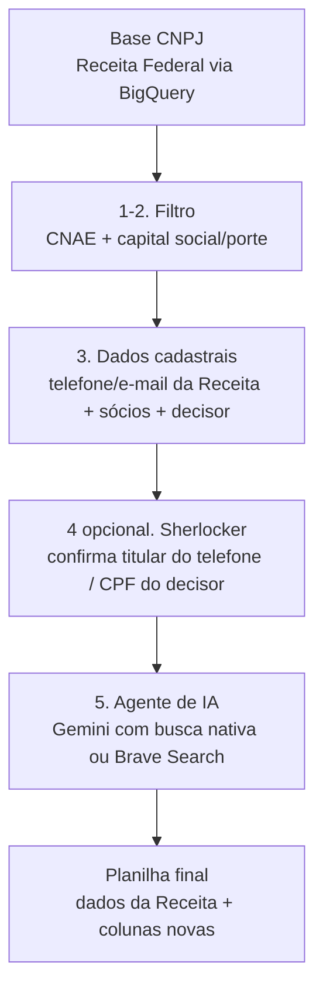

## Visão geral



Os scripts completos deste guia estão em
[`/scripts/prospeccao-cnpj`](https://github.com/binaryxz/docs/tree/main/scripts/prospeccao-cnpj)
neste repositório. Esse diretório é **genérico** — o CNAE alvo, o teto de
capital social e as demais regras de negócio ficam num único arquivo,
`config.py` (copiado de `config.example.py`), para replicar o pipeline em
outro cliente sem tocar no resto do código.

<Note>
  Os dados de sócios (nome, CPF/CNPJ, cargo) são dados pessoais. Trate a
  planilha final como informação sensível: acesso restrito ao time
  comercial e descarte quando o lead não avançar, conforme a LGPD.
</Note>

## Pré-requisitos

- Projeto no Google Cloud com BigQuery habilitado (a base pública de CNPJ é
  consultada via o projeto `basedosdados`, sem custo de armazenamento, só
  de consulta) — **ou**, alternativamente, os
  [arquivos abertos de CNPJ da Receita Federal](https://arquivos.receitafederal.gov.br/dados/cnpj/dados_abertos_cnpj/)
  processados localmente (sem GCP).
- Uma chave de API do Gemini (`GEMINI_API_KEY`) para a etapa 5, opção A.
- Python 3.10+ com as dependências de
  `scripts/prospeccao-cnpj/requirements.txt`.

### Setup do Google Cloud / BigQuery

1. Criar projeto GCP com billing habilitado
   (console.cloud.google.com/projectcreate).
2. Ativar a API do BigQuery (`apis/library/bigquery.googleapis.com`).
3. Criar service account com roles **BigQuery Job User** + **BigQuery Data
   Viewer** (gera o JSON de credencial).
   <Warning>
     Essas duas roles NÃO incluem `bigquery.datasets.create` — se quiser
     persistir resultados em tabelas (em vez de só puxar pra
     DataFrame/CSV), precisa também de **BigQuery Data Editor** ou usar a
     role mais ampla **BigQuery User**.
   </Warning>
4. No ambiente de execução: `pip install google-cloud-bigquery pandas
   db-dtypes` (numa venv, se o sistema tiver Python gerenciado
   externamente), `GOOGLE_APPLICATION_CREDENTIALS=/caminho/da/chave.json`.
5. O dataset `basedosdados` é público — não precisa estar no seu projeto,
   só precisa de UM projeto seu com billing pra rodar a query contra ele. O
   custo real deve ficar dentro da cota gratuita de 1TB/mês do BigQuery
   pra volumes desse tipo (dezenas de GB por consulta bem filtrada).

<Warning>
  Nunca commitar chaves de API ou a service account key no repositório
  git. Guarde em variável de ambiente, lida de um arquivo fora do controle
  de versão. Se uma chave for colada em texto puro num chat, trate como
  comprometida: revogue/rotacione depois de usar.
</Warning>

## Configuração do ICP (config.py)

```bash
cd scripts/prospeccao-cnpj
cp config.example.py config.py
```

Edite `config.py` com o ICP do cliente:

| Campo | O que é |
|---|---|
| `CNAES_ALVO` | dict `{codigo: peso}` — peso 2 = CNAE principal/core, peso 1 = auxiliar/genérico |
| `LIMIAR_PERCENTUAL` | % mínimo do peso total de CNAE que a empresa precisa bater (padrão 0.6) |
| `CAPITAL_SOCIAL_MAX` | teto de capital social (`None` = sem teto) |
| `PORTES_ALVO` | códigos de porte (`1`=Micro, `3`=Pequena, `5`=Demais); `None` = sem filtro |
| `PALAVRAS_CHAVE_NOME` | termos que, na razão social/nome fantasia, também qualificam o lead |
| `QUALIFICACOES_DECISOR` | códigos de qualificação de sócio que indicam cargo de administração/direção (raramente muda entre clientes) |

`filtrar_cnpjs_local.py` importa `config.py` diretamente. As queries SQL
(`filtro_cnae.sql`, `socios_decisor.sql`) não conseguem importar Python —
copie os mesmos valores para o bloco `CONFIGURAÇÃO` no topo de cada arquivo
`.sql` (documentado nos próprios comentários dos arquivos).

<Tip>
  Comece com uma lista curta e específica de CNAEs/palavras-chave — termos
  genéricos demais geram muitos falsos positivos. O filtro por CNAE
  costuma cobrir a maior parte do universo real; palavras-chave são só um
  complemento.
</Tip>

## Etapas 1-2 — Filtro por CNAE + capital social/porte

Fonte: [Base dos Dados](https://basedosdados.org), que replica os arquivos
públicos da Receita Federal (Empresas, Estabelecimentos, Sócios) como
dataset público no BigQuery.

<Warning>
  As tabelas `estabelecimentos`/`empresas`/`socios` de
  `basedosdados.br_me_cnpj` são **snapshots mensais completos**
  (particionadas por `data`, clusterizadas por `ano,mes`). Sem filtrar
  `ano`/`mes`, uma query nelas escaneia TODO o histórico (centenas de GB,
  bilhões de linhas). Rode `descobrir_periodo.sql` primeiro:

  ```sql
  SELECT ano, mes FROM `basedosdados.br_me_cnpj.estabelecimentos`
  GROUP BY ano, mes ORDER BY ano DESC, mes DESC LIMIT 1
  ```

  e preencha `ano_referencia`/`mes_referencia` em `filtro_cnae.sql` e
  `socios_decisor.sql` com o resultado.
</Warning>

Nomes de coluna neste dataset que divergem do que "faria sentido" assumir
(validado em 2026-09):
- `situacao_cadastral` vem **sem zero à esquerda**: `'2'` (ativa), não
  `'02'`.
- Não existe `correio_eletronico`/`uf`/`municipio` em `estabelecimentos`:
  são `email`, `sigla_uf`, `id_municipio` (este último é **código IBGE**,
  não nome).
- Em `socios`: não é
  `nome_socio_razao_social`/`cnpj_cpf_socio`/`qualificacao_socio`, é
  `nome`/`documento`/`qualificacao`.
- `empresas` não tem headcount de funcionários — só `porte` (código de
  faixa de faturamento: `1`=Micro, `3`=Pequena, `5`=Demais) e
  `capital_social` (FLOAT).

<Tip>
  Sempre rode uma query de amostra (`LIMIT 10`) pra conferir nomes de
  coluna e formato de valores reais antes de montar a query final — não
  confie no nome "óbvio" da coluna, principalmente se o esquema do dataset
  mudar no futuro.
</Tip>

Um CNPJ entra no resultado quando:
- a soma de pesos dos CNAEs de `CNAES_ALVO` que ele tem (principal +
  secundários) é pelo menos `LIMIAR_PERCENTUAL` da soma total de pesos,
  **ou** a razão social/nome fantasia contém algum termo de
  `PALAVRAS_CHAVE_NOME`;
- **e** o capital social está dentro de `CAPITAL_SOCIAL_MAX` (se
  configurado) e o porte está em `PORTES_ALVO` (se configurado).

```sql filtro_cnae.sql
-- query completa em scripts/prospeccao-cnpj/filtro_cnae.sql
```

Rode a query completa e salve o resultado em uma tabela (ex.:
`meu_projeto.prospeccao.leads_filtrados`) — ela será a entrada da etapa 3.

### Alternativa sem BigQuery: `filtrar_cnpjs_local.py`

Se você não tem (ou não quer usar) um projeto Google Cloud,
`scripts/prospeccao-cnpj/filtrar_cnpjs_local.py` faz o mesmo filtro (etapas
1-3 juntas, incluindo decisor) rodando localmente sobre os
[arquivos abertos de CNPJ da Receita Federal](https://arquivos.receitafederal.gov.br/dados/cnpj/dados_abertos_cnpj/)
— sem custo de API, só tempo de CPU. Lê `CNAES_ALVO`/`LIMIAR_PERCENTUAL`/
`CAPITAL_SOCIAL_MAX`/`PORTES_ALVO`/`PALAVRAS_CHAVE_NOME` diretamente de
`config.py`.

<Note>
  Este script processa os arquivos ORIGINAIS da Receita, cujo layout de
  colunas é diferente do dataset `basedosdados` usado nas queries SQL
  acima (ex.: `situacao_cadastral` com zero à esquerda,
  `correio_eletronico`/`uf`/`municipio` são os nomes corretos nesse
  layout). Os dois caminhos não misturam schemas.
</Note>

```bash
python scripts/prospeccao-cnpj/filtrar_cnpjs_local.py \
  --estabelecimentos "dados/*ESTABELE*" \
  --empresas "dados/*EMPRECSV*" \
  --socios "dados/*SOCIOCSV*" \
  --saida leads_com_socios.csv
```

Aceita tanto os arquivos originais da Receita (sem cabeçalho, `;`,
Latin-1) quanto CSVs já com cabeçalho — detecta automaticamente. Processa
por streaming (linha a linha, sem carregar os arquivos inteiros em
memória), então funciona mesmo sobre a base nacional completa (dezenas de
milhões de linhas), mas pode levar de minutos a horas dependendo do volume
e do hardware.

## Etapa 3 — Dados cadastrais e decisor (caminho BigQuery)

A própria base de Estabelecimentos já traz telefone (DDD + número, até 2
linhas) e e-mail corporativo declarado à Receita — sem custo ou API
externa.

Para sócios e decisor, cruzamos com a base de Sócios e priorizamos quem
tem qualificação de administração/direção (Administrador,
Sócio-Administrador, Diretor, Presidente); na ausência de um cargo desses,
usamos o sócio mais antigo cadastrado. Veja
`scripts/prospeccao-cnpj/socios_decisor.sql`.

Depois de salvar os resultados de `filtro_cnae.sql` e `socios_decisor.sql`
em tabelas, junte os dois com `scripts/prospeccao-cnpj/join_leads_socios.sql`
(LEFT JOIN por `cnpj_basico`) e exporte o resultado como
`leads_com_socios.csv` — é esse arquivo que alimenta a etapa 4 (ou, se você
pular essa etapa, diretamente a etapa 5.

## Etapa 4 (opcional) — Confirmar titular do telefone via Sherlocker

<Warning>
  Esta etapa é uma **exceção deliberada** à regra do resto do pipeline: ela
  usa um serviço de terceiros (data broker) que identifica o titular de um
  número de telefone e consulta telefones por CPF — exatamente o tipo de
  fonte que o agente de IA da etapa 5 é instruído a **nunca** usar. Ela
  existe porque foi avaliada e aceita para este fluxo específico (confirmar
  contato comercial de um provável decisor de uma empresa já filtrada como
  lead B2B), não porque deixou de ser dado pessoal sensível. Mantenha a
  mesma política de acesso restrito/descarte já citada acima para dados de
  sócios, e nunca reaproveite essa lógica para consultar CPF de qualquer
  pessoa fora deste fluxo.
</Warning>

`scripts/prospeccao-cnpj/verificar_telefone_decisor.py` usa a API REST do
[Sherlocker](https://docs.sherlocker.com.br) (não o servidor MCP — que é
voltado a clientes interativos como Claude Desktop/Cursor, não a scripts em
lote) para, por lead:

1. Verificar de quem é o telefone que a Receita Federal declarou (`GET
   /pessoas/telefone/{numero}`).
2. Confirmar se é a mesma pessoa do decisor identificado em
   `socios_decisor.sql` — **por nome normalizado**, não por CPF exato (ver
   aviso abaixo).
3. Senão, busca telefones do próprio CPF do decisor (`GET
   /telefones/cpf/{cpf}`, só quando o CPF não estiver mascarado) e usa **no
   máximo 2** números encontrados.

<Warning>
  **CPF mascarado**: a Receita Federal mascara o CPF de sócio pessoa física
  nos dados públicos (`documento` vem tipo `***257278**`, só 6 dos 11
  dígitos visíveis). Uma comparação exata de CPF entre a base da Receita e
  o CPF completo do Sherlocker **não funciona** por isso —
  `verificar_telefone_decisor.py` compara por NOME normalizado (sem
  acento, maiúsculas, ignorando "DE/DA/DO", exigindo pelo menos 2 tokens em
  comum) como critério principal. Também não dá pra "buscar telefone a
  partir do CPF do decisor" quando só se tem o CPF mascarado — a maioria
  das APIs de busca reversa exige CPF completo.
</Warning>

```bash
export SHERLOCKER_API_KEY="sua-chave"  # nunca no código — só variável de ambiente
python scripts/prospeccao-cnpj/verificar_telefone_decisor.py \
  leads_com_socios.csv leads_com_telefone_decisor.csv
```

Adiciona ao CSV as colunas `titular_telefone_nome`,
`titular_telefone_documento`, `telefone_confere_decisor`
(`sim`/`nao`/`sem_telefone_declarado`/`sem_decisor_identificado`),
`telefone_decisor_sherlocker_1`, `telefone_decisor_sherlocker_2` e
`motivo_telefone_decisor`. Respeita o rate limit documentado (60 req/min)
com backoff em 429, e é retomável (pula CNPJs já presentes na saída).

<Note>
  A taxa de confirmação ("telefone da empresa = telefone pessoal do
  decisor") é baixa por natureza — a maioria das empresas não declara o
  celular pessoal do sócio como telefone oficial do CNPJ. Não interprete
  uma taxa baixa como bug da ferramenta.
</Note>

Se você já tem um `telefone_decisor_sherlocker_1` confirmado, pode pular a
busca do decisor na etapa 5 com `--pular-com-contato
telefone_decisor_sherlocker_1` (mesma flag de
`enrich_leads.py`/`agentic_enrich.py`), economizando chamadas de IA.

## Etapa 5 — Agente de IA (pesquisa ativa + fonte)

Existem três implementações, escolha conforme seu acesso e orçamento.

### Opção A — Grounding nativo do Gemini (mais simples, exige billing)

Usa a ferramenta `google_search` embutida do Gemini: uma chamada, o próprio
Gemini decide pesquisar e responde já com as fontes. Mais simples, mas a
Google exige uma conta de faturamento vinculada ao projeto para usar essa
ferramenta (mesmo que o uso fique dentro da faixa gratuita).

```python enrich_leads.py
response = client.models.generate_content(
    model="gemini-flash-latest",
    contents=prompt,
    config=types.GenerateContentConfig(
        tools=[types.Tool(google_search=types.GoogleSearch())],
        response_mime_type="application/json",
        response_schema=RESPONSE_SCHEMA,
    ),
)
# response.candidates[0].grounding_metadata.grounding_chunks -> fontes usadas
```

Se o CSV de entrada tiver a coluna `nome_decisor` (vinda de
`join_leads_socios.sql`), ela é passada como contexto extra na busca —
ajuda a desambiguar empresas com nome genérico, mas não é obrigatória.
Também tenta achar um contato profissional do decisor (LinkedIn, e
telefone só se estiver publicamente associado a essa pessoa) quando
`nome_decisor` está preenchido.

```bash
export GEMINI_API_KEY="sua-chave"
pip install -r scripts/prospeccao-cnpj/requirements.txt
python scripts/prospeccao-cnpj/enrich_leads.py leads_com_socios.csv leads_enriquecidos.csv
```

<Tip>
  Se a base de entrada já traz telefone/e-mail pra boa parte dos leads
  (comum em bases de terceiros, diferente da saída "crua" da Receita), use
  `--pular-com-contato telefone_1,email` (troque pelos nomes das colunas
  relevantes) para pular esses leads sem gastar chamada de API — reduz
  custo quando só uma fração da base realmente precisa de busca. Mesma
  flag disponível em `agentic_enrich.py`.
</Tip>

### Opção B — Agente com busca ativa (sem billing no Gemini, precisa de rede aberta)

Em vez de um grounding de busca única, o Gemini age como um **agente**:
recebe duas ferramentas via function calling — `buscar_web(query)` (Brave
Search, plano gratuito) e `registrar_resultado(...)` (finaliza a
investigação). O próprio modelo decide quantas buscas fazer e com quais
termos, dentro de um orçamento máximo por empresa.

<Warning>
  O Brave Search não é alcançável em ambientes de rede restrita/sandbox —
  só domínios `googleapis.com` costumam passar por políticas de rede
  corporativas. Rode esta opção em um ambiente com acesso normal à
  internet.
</Warning>

```bash
export GEMINI_API_KEY="sua-chave"      # grátis, sem billing (não usa grounding nativo)
export BRAVE_API_KEY="sua-chave-brave" # a conta usada aqui costuma ser billing por unidades pré-pagas — confira saldo
pip install -r scripts/prospeccao-cnpj/requirements.txt
python scripts/prospeccao-cnpj/agentic_enrich.py leads_com_socios.csv leads_enriquecidos.csv
```

### Opção C — Só Brave Search, sem LLM (mais barata)

`enrich_leads_gratis.py` usa heurísticas de regex/domínio sobre os
resultados do Brave Search, sem nenhuma chamada de IA — precisão menor,
mas útil como primeira triagem da base inteira (rode a versão com IA
depois só no subconjunto que passar). Suporta `--max-funcionarios` pra
filtrar por porte via faixa de funcionários do LinkedIn.

<Note>
  Não dá pra extrair contagem exata de funcionários do LinkedIn via busca
  simples — o snippet retornado pelo Brave/Google mostra número de
  **seguidores**, não de funcionários. `enrich_leads_gratis.py` extrai a
  faixa "X-Y employees" quando o Brave a indexa no resumo, mas isso é
  menos confiável que abrir a página de verdade.
</Note>

```bash
export BRAVE_API_KEY="sua-chave"
python scripts/prospeccao-cnpj/enrich_leads_gratis.py leads_com_socios.csv leads_enriquecidos.csv
```

Todas as opções gravam incrementalmente (`flush` a cada linha) e pulam
leads já processados se você rodar de novo em cima do mesmo arquivo de
saída — uma falha no meio não perde o progresso.

## Planilha final

```bash
python scripts/prospeccao-cnpj/build_planilha_final.py \
  leads_com_socios.csv leads_enriquecidos.csv planilha_final.xlsx
```

O resultado (`planilha_final.xlsx`) tem uma linha por CNPJ, com todos os
dados cadastrais da Receita + sócios/decisor + as colunas novas da IA
(`site_oficial`, `telefone_comercial_ia`, `whatsapp_publico`,
`linkedin_decisor`, `telefone_decisor_ia`, `fonte_ia`, `confianca_ia`).

## Etapa 6 (opcional) — adaptar para outra ferramenta

Se o destino final for outra ferramenta (disparo de WhatsApp, CRM, etc.)
com seu próprio formato de importação, `adaptar_formato_importacao.py`
remapeia a saída do pipeline para esse formato — por padrão, colunas
`nome, primeiro_nome, telefone, email, regiao, valor`:

```bash
python scripts/prospeccao-cnpj/adaptar_formato_importacao.py \
  leads_com_socios.csv leads_enriquecidos.csv saida_importacao.csv \
  --fonte-original base_original.xlsx
```

`--fonte-original` é opcional: se a base original (antes do filtro) já
trouxer e-mail/telefone brutos, esse arquivo é usado como fallback para
quem a IA não achou nada.
