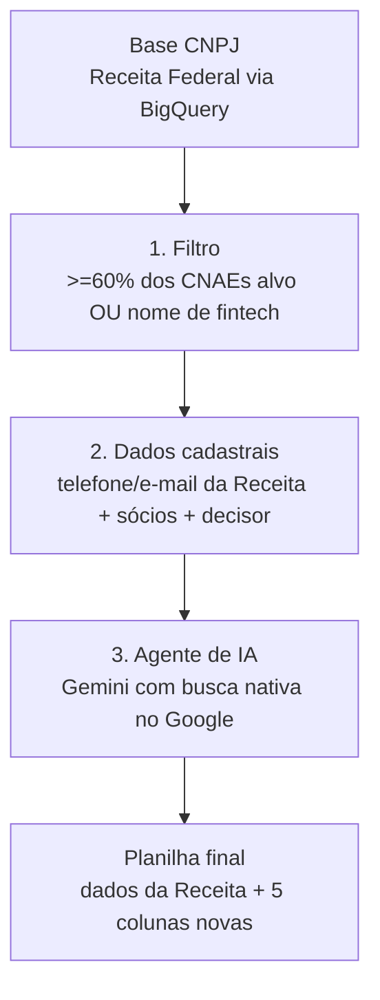

## Visão geral



Os scripts completos deste guia estão em [`/scripts/prospeccao-fintech`](https://github.com/binaryxz/docs/tree/main/scripts/prospeccao-fintech) neste repositório.

## Pré-requisitos

- Projeto no Google Cloud com BigQuery habilitado (a base pública de CNPJ é consultada via o projeto `basedosdados`, sem custo de armazenamento, só de consulta).
- Uma chave de API do Gemini (`GEMINI_API_KEY`) para a etapa 3.
- Python 3.10+ com as dependências de `scripts/prospeccao-fintech/requirements.txt`.

<Note>
  Os dados de sócios (nome, CPF/CNPJ, cargo) são dados pessoais. Trate a planilha final como informação sensível: acesso restrito ao time comercial e descarte quando o lead não avançar, conforme a LGPD.
</Note>

## Etapa 1 — Filtro por CNAE na base de CNPJ

Fonte: [Base dos Dados](https://basedosdados.org), que replica os arquivos públicos da Receita Federal (Empresas, Estabelecimentos, Sócios) como dataset público no BigQuery.

### CNAEs alvo

| Tipo | Código | Descrição |
|---|---|---|
| Principal | 74.90-1-04 | Intermediação e agenciamento de serviços e negócios em geral, exceto imobiliários |
| Secundário | 62.03-1-00 | Desenvolvimento e licenciamento de programas de computador não-customizáveis |
| Secundário | 70.20-4-00 | Consultoria em gestão empresarial |
| Secundário | 62.01-5-01 | Desenvolvimento de programas de computador sob encomenda |
| Secundário | 82.99-7-99 | Outras atividades de serviços prestados às empresas |
| Secundário | 62.09-1-00 | Suporte técnico, manutenção e outros serviços em TI |
| Secundário | 66.19-3-99 | Outras atividades auxiliares dos serviços financeiros |

### Regra do filtro

Um CNPJ entra na lista quando:

- **pelo menos 60% dos 7 CNAEs acima** (ou seja, 5 de 7) estão registrados nele, entre CNAE principal e secundários; **ou**
- a razão social ou o nome fantasia contém "fintech".

```sql filtro_cnae.sql
DECLARE cnaes_alvo ARRAY<STRING> DEFAULT [
  '7490104', '6203100', '7020400', '6201501', '8299799', '6209100', '6619399'
];
DECLARE limiar_percentual FLOAT64 DEFAULT 0.6;

-- query completa em scripts/prospeccao-fintech/filtro_cnae.sql
```

Rode a query completa e salve o resultado em uma tabela (ex.: `meu_projeto.prospeccao.leads_filtrados`) — ela será a entrada da etapa 2.

<Tip>
  Ajuste o limiar (`limiar_percentual`) ou a lista de CNAEs conforme o ICP mudar; nenhuma outra etapa do fluxo depende desses valores.
</Tip>

## Etapa 2 — Dados cadastrais e decisor

A própria base de Estabelecimentos já traz telefone (DDD + número, até 2 linhas) e e-mail corporativo declarado à Receita — sem custo ou API externa.

Para sócios e decisor, cruzamos com a base de Sócios e priorizamos quem tem qualificação de administração/direção (Administrador, Sócio-Administrador, Diretor, Presidente); na ausência de um cargo desses, usamos o sócio mais antigo cadastrado.

Veja `scripts/prospeccao-fintech/socios_decisor.sql`.

## Etapa 3 — Agente de IA (pesquisa + fonte)

Para cada lead que sai da etapa 2, o agente:

1. Pede ao **Gemini com grounding de busca nativa** (`google_search` tool) para pesquisar a empresa.
2. Extrai do resultado: site oficial, telefone comercial público e WhatsApp comercial público.
3. Registra a **fonte** de cada achado a partir dos `grounding_chunks` retornados pela API (as URLs realmente usadas pelo modelo para responder).
4. Atribui um nível de confiança (`alta`/`media`/`baixa`).

```python enrich_leads.py
response = client.models.generate_content(
    model="gemini-2.5-flash",
    contents=prompt,
    config=types.GenerateContentConfig(
        tools=[types.Tool(google_search=types.GoogleSearch())],
        response_mime_type="application/json",
        response_schema=RESPONSE_SCHEMA,
    ),
)
# response.candidates[0].grounding_metadata.grounding_chunks -> fontes usadas
```

Script completo: `scripts/prospeccao-fintech/enrich_leads.py`. Ele:

- lê o CSV exportado das etapas 1-2,
- pesquisa lead a lead (com retry e limite de 1 chamada/segundo para respeitar rate limit),
- grava um CSV incremental (`flush` a cada linha), então uma falha no meio não perde o progresso já feito.

Rodar:

```bash
export GEMINI_API_KEY="sua-chave"
pip install -r scripts/prospeccao-fintech/requirements.txt
python scripts/prospeccao-fintech/enrich_leads.py leads_com_socios.csv leads_enriquecidos.csv
```

## Planilha final

O último script junta tudo e adiciona as 5 colunas novas:

| Coluna nova | Descrição |
|---|---|
| `site_oficial` | URL do site oficial encontrado pela IA |
| `telefone_comercial_ia` | Telefone comercial encontrado na web (complementa o da Receita) |
| `whatsapp_publico` | Número de WhatsApp comercial público |
| `fonte_ia` | URLs usadas pela IA para confirmar os dados acima |
| `confianca_ia` | `alta` / `media` / `baixa` |

```bash
python scripts/prospeccao-fintech/build_planilha_final.py \
  leads_com_socios.csv leads_enriquecidos.csv planilha_final.xlsx
```

O resultado (`planilha_final.xlsx`) tem uma linha por CNPJ, com todos os dados cadastrais da Receita + sócios/decisor + as 5 colunas da IA acima.
