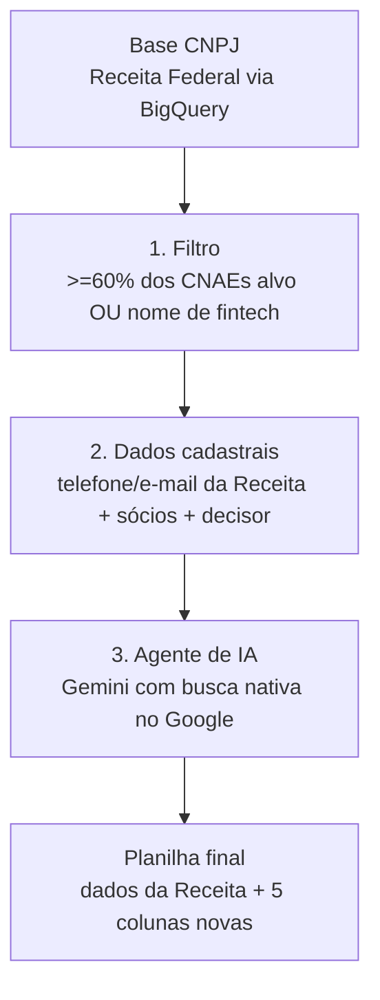

## Visão geral



Os scripts completos deste guia estão em [`/scripts/prospeccao-fintech`](https://github.com/binaryxz/docs/tree/main/scripts/prospeccao-fintech) neste repositório.

## Pré-requisitos

- Projeto no Google Cloud com BigQuery habilitado (a base pública de CNPJ é consultada via o projeto `basedosdados`, sem custo de armazenamento, só de consulta).
- Uma chave de API do Gemini (`GEMINI_API_KEY`) para a etapa 3.
- Python 3.10+ com as dependências de `scripts/prospeccao-fintech/requirements.txt`.

<Note>
  Os dados de sócios (nome, CPF/CNPJ, cargo) são dados pessoais. Trate a planilha final como informação sensível: acesso restrito ao time comercial e descarte quando o lead não avançar, conforme a LGPD.
</Note>

## Etapa 1 — Filtro por CNAE na base de CNPJ

Fonte: [Base dos Dados](https://basedosdados.org), que replica os arquivos públicos da Receita Federal (Empresas, Estabelecimentos, Sócios) como dataset público no BigQuery.

### CNAEs alvo

| Tipo | Código | Descrição |
|---|---|---|
| Principal | 74.90-1-04 | Intermediação e agenciamento de serviços e negócios em geral, exceto imobiliários |
| Secundário | 62.03-1-00 | Desenvolvimento e licenciamento de programas de computador não-customizáveis |
| Secundário | 70.20-4-00 | Consultoria em gestão empresarial |
| Secundário | 62.01-5-01 | Desenvolvimento de programas de computador sob encomenda |
| Secundário | 82.99-7-99 | Outras atividades de serviços prestados às empresas |
| Secundário | 62.09-1-00 | Suporte técnico, manutenção e outros serviços em TI |
| Secundário | 66.19-3-99 | Outras atividades auxiliares dos serviços financeiros não especificadas anteriormente |
| Secundário | 66.19-3-02 | Correspondentes de instituições financeiras |
| Secundário | 82.91-1-00 | Atividades de cobranças e informações cadastrais |

### Regra do filtro

Um CNPJ entra na lista quando:

- **pelo menos 60% dos 9 CNAEs acima** (ou seja, 6 de 9) estão registrados nele, entre CNAE principal e secundários; **ou**
- a razão social ou o nome fantasia contém "fintech".

```sql filtro_cnae.sql
DECLARE cnaes_alvo ARRAY<STRING> DEFAULT [
  '7490104', '6203100', '7020400', '6201501', '8299799', '6209100',
  '6619399', '6619302', '8291100'
];
DECLARE limiar_percentual FLOAT64 DEFAULT 0.6;

-- query completa em scripts/prospeccao-fintech/filtro_cnae.sql
```

Rode a query completa e salve o resultado em uma tabela (ex.: `meu_projeto.prospeccao.leads_filtrados`) — ela será a entrada da etapa 2.

<Tip>
  Ajuste o limiar (`limiar_percentual`) ou a lista de CNAEs conforme o ICP mudar; nenhuma outra etapa do fluxo depende desses valores.
</Tip>

### Alternativa sem BigQuery: `filtrar_cnpjs_local.py`

Se você não tem (ou não quer usar) um projeto Google Cloud, `scripts/prospeccao-fintech/filtrar_cnpjs_local.py` faz o mesmo filtro (etapas 1 e 2 juntas) rodando localmente sobre os [arquivos abertos de CNPJ da Receita Federal](https://arquivos.receitafederal.gov.br/dados/cnpj/dados_abertos_cnpj/) — sem custo de API, só tempo de CPU. Além do match por CNAE, também casa uma lista mais ampla de palavras-chave (pagamento, pay, bank, banco, crédito, investimento, etc. — editável em `PALAVRAS_CHAVE_FINTECH` no topo do script) contra razão social e nome fantasia, não só a palavra "fintech" literal.

```bash
python scripts/prospeccao-fintech/filtrar_cnpjs_local.py \
  --estabelecimentos "dados/*ESTABELE*" \
  --empresas "dados/*EMPRECSV*" \
  --socios "dados/*SOCIOCSV*" \
  --saida leads_com_socios.csv
```

Aceita tanto os arquivos originais da Receita (sem cabeçalho, `;`, Latin-1) quanto CSVs já com cabeçalho — detecta automaticamente. Processa por streaming (linha a linha, sem carregar os arquivos inteiros em memória), então funciona mesmo sobre a base nacional completa (dezenas de milhões de linhas), mas pode levar de minutos a horas dependendo do volume e do hardware.

## Etapa 2 — Dados cadastrais e decisor

A própria base de Estabelecimentos já traz telefone (DDD + número, até 2 linhas) e e-mail corporativo declarado à Receita — sem custo ou API externa.

Para sócios e decisor, cruzamos com a base de Sócios e priorizamos quem tem qualificação de administração/direção (Administrador, Sócio-Administrador, Diretor, Presidente); na ausência de um cargo desses, usamos o sócio mais antigo cadastrado.

Veja `scripts/prospeccao-fintech/socios_decisor.sql`.

Depois de salvar os resultados de `filtro_cnae.sql` e `socios_decisor.sql` em tabelas, junte os dois com `scripts/prospeccao-fintech/join_leads_socios.sql` (LEFT JOIN por `cnpj_basico`) e exporte o resultado como `leads_com_socios.csv` — é esse arquivo que alimenta a etapa 3.

## Etapa 3 — Agente de IA (pesquisa ativa + fonte)

Existem duas implementações, escolha conforme seu acesso:

### Opção A — Grounding nativo do Gemini (mais simples, exige billing)

Usa a ferramenta `google_search` embutida do Gemini: uma chamada, o próprio Gemini decide pesquisar e responde já com as fontes. Mais simples, mas a Google exige uma conta de faturamento vinculada ao projeto para usar essa ferramenta (mesmo que o uso fique dentro da faixa gratuita).

```python enrich_leads.py
response = client.models.generate_content(
    model="gemini-flash-latest",
    contents=prompt,
    config=types.GenerateContentConfig(
        tools=[types.Tool(google_search=types.GoogleSearch())],
        response_mime_type="application/json",
        response_schema=RESPONSE_SCHEMA,
    ),
)
# response.candidates[0].grounding_metadata.grounding_chunks -> fontes usadas
```

Se o CSV de entrada tiver a coluna `nome_decisor` (vinda de `join_leads_socios.sql`), ela é passada como contexto extra na busca — ajuda a desambiguar empresas com nome genérico, mas não é obrigatória.

Também tenta achar um contato profissional do decisor (LinkedIn, e telefone só se estiver publicamente associado a essa pessoa) quando `nome_decisor` está preenchido.

Script completo: `scripts/prospeccao-fintech/enrich_leads.py`.

```bash
export GEMINI_API_KEY="sua-chave"
pip install -r scripts/prospeccao-fintech/requirements.txt
python scripts/prospeccao-fintech/enrich_leads.py leads_com_socios.csv leads_enriquecidos.csv
```

<Tip>
  Se a base de entrada já traz telefone/e-mail pra boa parte dos leads (comum
  em bases de terceiros, diferente da saída "crua" da Receita), use
  `--pular-com-contato telefone_1,correio_eletronico` (troque pelos nomes das
  colunas relevantes) para pular esses leads sem gastar chamada de API —
  reduz custo quando só uma fração da base realmente precisa de busca. Mesma
  flag disponível em `agentic_enrich.py`.
</Tip>

### Opção B — Agente com busca ativa (sem billing no Gemini, precisa de rede aberta)

Em vez de um grounding de busca única, o Gemini age como um **agente**: recebe duas ferramentas via function calling —

- `buscar_web(query)` → pesquisa no [Brave Search API](https://brave.com/search/api/) (plano gratuito, sem cartão) e devolve título/URL/resumo dos resultados;
- `registrar_resultado(...)` → finaliza a investigação desta empresa com os campos estruturados.

O próprio modelo decide **quantas buscas fazer e com quais termos** (ex.: primeiro `"<empresa> <cidade>"` para achar o site, depois `"<empresa> telefone"` ou `"<empresa> whatsapp"` para confirmar contato), dentro de um orçamento máximo de buscas por empresa — mais próximo de como um analista pesquisaria manualmente do que uma única query.

```python agentic_enrich.py
TOOLS = [types.Tool(function_declarations=[
    types.FunctionDeclaration(name="buscar_web", ...),
    types.FunctionDeclaration(name="registrar_resultado", ...),
])]

for _ in range(max_searches + 2):
    response = client.models.generate_content(
        model="gemini-flash-latest",
        contents=contents,
        config=types.GenerateContentConfig(system_instruction=SYSTEM_INSTRUCTION, tools=TOOLS),
    )
    # se o modelo chamou buscar_web -> roda brave_search() e devolve o resultado
    # se chamou registrar_resultado -> encerra e retorna os campos estruturados
```

Script completo: `scripts/prospeccao-fintech/agentic_enrich.py`. Funciona com qualquer CSV — usa todas as colunas preenchidas do lead como contexto de busca, então serve tanto para a saída da etapa 1-2 (`cnpj, razao_social, ...`) quanto para outras bases de empresas.

<Warning>
  O Brave Search e o `api.deepseek.com` (caso opte por trocar o modelo de extração) não são alcançáveis em ambientes de rede restrita/sandbox — só domínios `googleapis.com` costumam passar por políticas de rede corporativas. Rode esta opção em um ambiente com acesso normal à internet.
</Warning>

```bash
export GEMINI_API_KEY="sua-chave"      # grátis, sem billing (não usa grounding nativo)
export BRAVE_API_KEY="sua-chave-brave" # plano gratuito, sem cartão
pip install -r scripts/prospeccao-fintech/requirements.txt
python scripts/prospeccao-fintech/agentic_enrich.py leads_com_socios.csv leads_enriquecidos.csv
```

Ambas as opções gravam incrementalmente (`flush` a cada linha) e pulam leads já processados se você rodar de novo em cima do mesmo arquivo de saída — uma falha no meio não perde o progresso.

## Planilha final

O último script junta tudo e adiciona as 5 colunas novas:

| Coluna nova | Descrição |
|---|---|
| `site_oficial` | URL do site oficial encontrado pela IA |
| `telefone_comercial_ia` | Telefone comercial encontrado na web (complementa o da Receita) |
| `whatsapp_publico` | Número de WhatsApp comercial público |
| `linkedin_decisor` | Perfil do LinkedIn do sócio/decisor, se achado |
| `telefone_decisor_ia` | Telefone pessoal do decisor — raramente preenchido, só com fonte pública explícita |
| `fonte_ia` | URLs usadas pela IA para confirmar os dados acima |
| `confianca_ia` | `alta` / `media` / `baixa` |

```bash
python scripts/prospeccao-fintech/build_planilha_final.py \
  leads_com_socios.csv leads_enriquecidos.csv planilha_final.xlsx
```

O resultado (`planilha_final.xlsx`) tem uma linha por CNPJ, com todos os dados cadastrais da Receita + sócios/decisor + as colunas da IA acima.

## Etapa 4 (opcional) — adaptar para outra ferramenta

Se o destino final for outra ferramenta (disparo de WhatsApp, CRM, etc.) com seu próprio formato de importação, `adaptar_formato_importacao.py` remapeia a saída do pipeline para esse formato — por padrão, colunas `nome, primeiro_nome, telefone, email, regiao, valor`:

```bash
python scripts/prospeccao-fintech/adaptar_formato_importacao.py \
  leads_com_socios.csv leads_enriquecidos.csv saida_importacao.csv \
  --fonte-original base_original.xlsx
```

`--fonte-original` é opcional: se a base original (antes do filtro) já trouxer e-mail/telefone brutos, esse arquivo é usado como fallback para quem a IA não achou nada (a IA não busca e-mail, só site/telefone/WhatsApp/LinkedIn). Esta é a entrega final por padrão: sempre que o pipeline for rodado, o resultado é convertido para esse formato antes de ser entregue.
