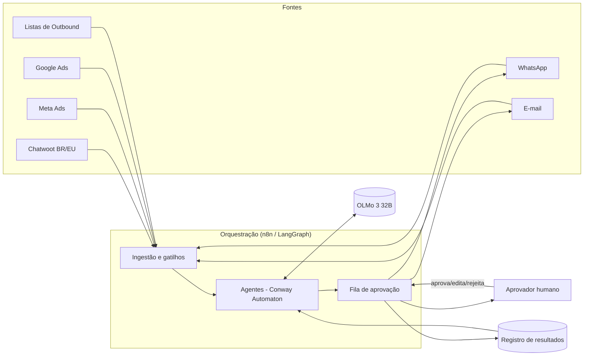

## Stack técnica

| Camada | Escolha | Papel |
| --- | --- | --- |
| LLM | **OLMo 3 32B** | Raciocínio, classificação de conversas, geração de sugestões de resposta e de melhoria |
| Modelo agentic | **[Conway Automaton](https://github.com/Conway-Research/automaton)** | Define os agentes (atendimento, mídia paga, influencers, outbound), suas ferramentas e memória |
| Orquestração de fluxos | **n8n** ou **LangGraph** | Conecta gatilhos, chamadas de API, aprovação humana e persistência de estado |
| Hospedagem | **[Run on Flux](https://runonflux.com/)** | Infraestrutura descentralizada para rodar o LLM, os agentes e os workflows |

### LLM — OLMo 3 32B

Modelo aberto usado como motor de raciocínio de todos os agentes. Servido via um endpoint compatível com OpenAI (ex.: vLLM ou Ollama) atrás da rede Flux, para que tanto o Conway Automaton quanto os workflows de orquestração o chamem como um serviço único e centralizado — evitando duplicar prompts/contexto entre os módulos.

### Modelo agentic — Conway Automaton

O [Conway Automaton](https://github.com/Conway-Research/automaton) organiza o comportamento de cada agente do módulo:

- **Agente de Atendimento** — monitora Chatwoot/WhatsApp, calcula SLA, sugere respostas.
- **Agente de Mídia Paga** — lê Meta Ads e Google Ads, correlaciona com Chatwoot, gera recomendações.
- **Agente de Influencers** — segmenta conversas por origem de influencer e avalia desempenho.
- **Agente de Outbound** — analisa listas, consultorias e equipes de disparo.

Cada agente tem acesso apenas às ferramentas (tools) necessárias para sua função, reduzindo o raio de ação de erros e facilitando auditoria.

<Warning>
  O Conway Automaton é, por padrão, um framework de agente autônomo de propósito geral: gera sua própria carteira on-chain, pode gastar créditos, se auto-modificar e se auto-replicar. Nada disso é necessário para este módulo. Antes de qualquer deploy, siga o checklist de restrições em [Deploy na Run on Flux](/modulo-vendas/deploy) para travar essas capacidades e garantir que nenhum envio a cliente ocorra sem aprovação humana.
</Warning>

### Orquestração — n8n ou LangGraph

<Tabs>
  <Tab title="n8n">
    Recomendado quando a maior parte do trabalho é **integração** (webhooks do Chatwoot, APIs de Meta/Google Ads, envio de WhatsApp/e-mail) e a equipe quer editar fluxos visualmente sem depender de deploys de código.
  </Tab>
  <Tab title="LangGraph">
    Recomendado quando a lógica do agente exige **estado e decisão mais complexos** (múltiplos passos de raciocínio, loops de auto-correção, ramificações condicionais no processo de aprovação), com o fluxo versionado como código.
  </Tab>
</Tabs>

Na prática, o módulo pode usar os dois: **n8n** como camada de integração/gatilhos (webhooks, agendamentos, envio de mensagens) chamando **LangGraph** para os trechos de raciocínio multi-passo do agente, com o Conway Automaton definindo os agentes que o LangGraph orquestra.

### Hospedagem — Run on Flux

O LLM, os agentes e os workflows rodam sobre a rede descentralizada da [Run on Flux](https://runonflux.com/), o que permite escalar horizontalmente conforme o volume de conversas/campanhas e manter a operação independente de um único provedor de nuvem.

## Visão de arquitetura

Toda a infraestrutura acima (orquestração, agentes e LLM) roda hospedada na Run on Flux.
